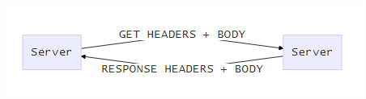

# Web scraping

- Web crawling
  - Saltar a diferentes webs en base a los links
- Web scraping
  - Extraer info de **1** web

## Funcionamiento del protocolo http (simplificado)

- Verbos

  - GET
  - POST
  - ...

Esquema básico (en el GET el body es opcional, en POST es obligatorio):

## Tipos de webs

- Estáticas + (dinámica lado servidor)
  - Nos centraremos en scrapear estas webs
- Dinámica lado cliente
  - ajax:
  - dom (html + eventos) (vista) cambiante. 
  - Mayor complejidad de scrapeo

## Herramientas básicas a construir / usar

- Básico: Librerías que combinan esas caracteríscticas: **scrapy, nutch**, jsoup (java)
  - Red -> http
    - URL lib -> un peñazo
    - requests
    - cURL
  - Extracción -> interpretar html
    - Beautiful Soap 4 -> Python
    - SXML -> LISP
  - Serializar -> (persistencia)
    - Estándar: JSON ... etc
- Extras
  - Proxy, VPN -> evitar bloqueo de IPs ...
  - Usar navegador headless

https://scrapy.org/-> Tienen un SASS para probar

### Herramientas developer del navegador

Nos van a ayudar en la tarea manual previa al scrapeo, para identificar patrones

- Consola Javascript
  - En principio no vamos a usarlo para el scraping
- Inspector
  - Inspeccionar un cacho de la página y ver su código fuente
- Red
  - Capturar todas las peticiones, por cada una de ellas:
    - Ver cabeceras
    - Respuesta
    - Campos
    - etc

## Formato URLs

<scheme>://[user:password]@host:[port]/path/path?[param1=value&param2=value][##Fragment]

## Cookies

- Tipos
  - ID (mesa 10)
  - DATA (Han sido 2 cervezas)
    - Van firmadas digitalmente
    - Pueden usarse para logarse entre sitios
- El servidor nos las da, se mandan en las headers
  - Bajo el campo cookie
    - set-cookie: key=vale; ...
    - set-cookie: key2=value2 ...
- Nosotros la devolvemos en las peticiones posteriores
  - Enviamos solo:
    - key=value;
    - key2=value2

## Curiosidad

Protocolo gopher, RFC sencilla de leer:

- https://tools.ietf.org/rfc/rfc1436.txt

## Renderizado externo para arañas

- Testing (utilidades de testing de un navegador)
- Navegador Headless
- Phantom js -> Deprecado -> Solo la parte del renderizado de un navegador (JS + css)
- Rendering as a service -> Como el phantom js pero en un servidor externo

- Webdriver -> Interfaz para testear diferentes navegadores (lo deben soportar)
  - Selenium: interfaz para manipular navegador a través de webdriver
  - Geckodriver: Proxy for using W3C WebDriver compatible clients to interact. HTTP API